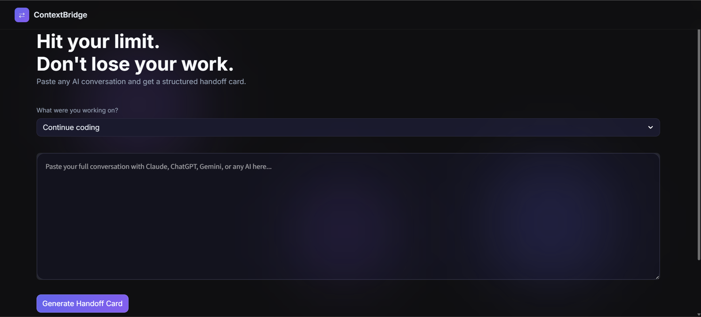

# ContextBridge ⇄

> Hit your AI's message limit? Don't lose your work.

ContextBridge compresses any AI conversation into a clean, structured handoff card.
Paste it into a new chat — Claude, ChatGPT, Gemini, anything — and continue exactly where you left off.

---

## The Problem

Every AI has a context limit. When you hit it mid-task, you're forced to start a new chat and re-explain everything from scratch. That's frustrating and wastes time.

## The Solution

ContextBridge analyzes your conversation and extracts:
- What you were trying to achieve
- Everything completed so far
- Tools and tech being used
- Exactly where you left off
- The immediate next step
- Any open questions

One paste. Any AI. Continue instantly.

---

## Demo



---

## How It Works

1. Paste your conversation into the text area
2. Select what you were working on
3. Click **Generate Handoff Card**
4. Copy the card and paste it into any new AI chat

Handles conversations of any length — intelligently trims oversized inputs
while preserving the beginning (context) and end (recent progress).

---

## Tech Stack

- **Python** — core logic
- **Groq API** (LLaMA 3.3 70B) — conversation analysis and summarization
- **Streamlit** — web interface
- **Prompt Engineering** — structured output extraction

---

## Run Locally

```bash
git clone https://github.com/YOUR_USERNAME/Context-Bridge.git
cd Context-Bridge
pip install streamlit groq python-dotenv
```

Create a `.env` file:
GROQ_API_KEY=your_groq_api_key_here

Run the app:
```bash
streamlit run app.py
```

---

## Future Improvements

- Browser extension for one-click export without manual copy-paste
- Auto-detect which AI platform the conversation is from
- Save and manage multiple handoff cards
- Direct "Continue in ChatGPT" and "Continue in Claude" buttons

---

## Why I Built This

I kept hitting Claude's message limit in the middle of complex coding sessions.
Switching to a new chat meant re-explaining the entire context.
I built ContextBridge to solve that problem for myself — and anyone else who works heavily with AI tools.